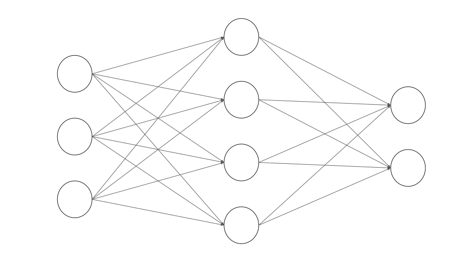

# Introduction

Until the early 2000s, neural networks were seen as one among several species in the zoo of ML algorithms. Due to a combination of several factors, the last decade witnessed intense research activity in this area. This resulted in neural networks becoming the model of choice in many domains of data science and AI. The impact was so huge that an entire field (deep learning) has blossomed out of it. One of the most important problems that contributed to the success of this model is image classification on large datasets, specifically the [ImageNet dataset](https://www.image-net.org/index.php).

In this course, we will study the most basic type of neural network called "feedforward networks". In a feedforward network, an input vector undergoes a sequence of transformations before it turns into the output. Each transformation is a linear combination of inputs followed by a non-linear activation function. Recall that this is similar to what happened in logistic regression. Instead of having just one unit, we have a network of units arranged in the form of layers:





The term feedforward is used as the input is always fed forward. So, a feedforward network can also be viewed as a directed acyclic graph (DAG), with the direction of the edges always leading from the input to the output.


# Black box

There are two ways to look at any ML model. The easiest and somewhat superficial way is to see it as a black-box that accepts an input and gives an output. This is true of any algorithm, not just ML models. Taking this route, a neural network is a model that learns some function:
$$
 h: \mathbb{R}^{m} \rightarrow \mathbb{R}^{k}
$$


For a regression problem, $k = 1$, and the output is interpreted as some real number. Given a data-point $\boldsymbol{x} \in \mathbb{R}^m$, we have:


$$
h(\boldsymbol{x}) = y
$$


In the case of a multi-class classification problem, the network outputs a vector of probabilities.
$$
h(\boldsymbol{x}) = \boldsymbol{\hat{y}}
$$
If the feature matrix $\boldsymbol{X}$ of size $n \times m$ is passed as input, we get a matrix of probabilities, $\boldsymbol{\hat{Y}}$ of size $n \times k$. Since each row of the matrix corresponds to a probability distribution over the $k$ classes, the following relation holds:


$$
\sum \limits_{j = 1}^{k} \hat{Y}_{ij} = 1 \quad 1 \leq i \leq n
$$


This equation can also be vectorized as follows:
$$
\boldsymbol{\hat{Y}} \boldsymbol{1}_{k} = \boldsymbol{1}_n
$$
Here, $\boldsymbol{1}_k$ and $\boldsymbol{1}_n$ are vectors of ones of sizes $k$ and $n$ respectively. For example:


$$
\boldsymbol{1}_k = \begin{bmatrix}
1\\
\vdots\\
1
\end{bmatrix}
$$


 In terms of `NumPy`, this is:

```python
one_k = np.ones(k)
one_n = np.ones(n)
```

This notation helps us express the row-wise sum of a matrix. This may seem like an arbitrary point now, but this notation will keep making an appearance at various places. The `NumPy` equivalent of the expression $\boldsymbol{\hat{Y}1}_k$ is this:

```python
Y_hat.sum(axis = 1)
```

