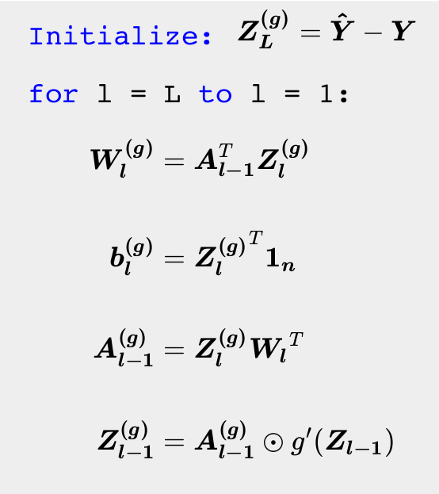

# Backward pass

As we have been doing all along, gradient descent will be our optimizer. We need to compute the gradients of the loss with respect to the weights and the biases. Imagine doing this for a network with thousands of parameters. We would have to find the derivative of the loss with respect to $1000$ different variables. This seems like a computational nightmare.

Thankfully, researchers have developed an efficient algorithm called **backpropagation** that does the job for us. At its heart, backpropagation uses the chain rule of differentiation to compute the gradients. The idea is to first begin with the gradients at the final layer and keep propagating them all the way back to the first layer. This sequence of operations is termed a backward pass, as we start from the final layer and let the gradients flow all the way back to the first layer. Just as we had a "forward pass" to compute the output given the input, we have a "backward pass" to compute the gradients of the loss with respect to the weights. The backward pass can be divided into two parts:

### Hidden Layers

The weights at layer $l$, $\boldsymbol{W_{l}}$, influence the loss via the matrix of activations, $\boldsymbol{A_{l}}$, at layer $l$. The equation that connects these two quantities is given below and should be familiar to you by now:

$$
\begin{aligned}
\boldsymbol{Z_{l}} &= \boldsymbol{A_{l - 1} W_l} + \boldsymbol{b_l},\quad 1 \leq l \leq L\\ \\
\boldsymbol{A_{l}} &= g(\boldsymbol{Z_{l}}),\quad 1 \leq l \leq L
\end{aligned}
$$

Let us assume that we already have access to the gradient of the loss with respect to the activations at layer $l$. Let us call it $\boldsymbol{A_{l}^{(g)}}$. This is a matrix of the same shape as $\boldsymbol{A_{l}}$. If we need the gradient of the loss with respect to the weights at layer $l$, then by the chain rule of differentiation, we need to compute the gradients with respect to the pre-activations at layer $l$. We shall use the following notation for the gradients at layer $l$:

- $\boldsymbol{W_{l}^{(g)}}$: gradient of the loss with respect to the weights
- $\boldsymbol{Z_{l}^{(g)}}$: gradient of the loss with respect to the pre-activations
- $\boldsymbol{A_{l}^{(g)}}$: gradient of the loss with respect to the activations

The rule is quite simple to state. It is just a product, the first one is element-wise product of two matrices, the second one is our usual matrix multiplication:

$$
\begin{aligned}
\boldsymbol{Z_{l}^{(g)}} &= \boldsymbol{A_{l}^{(g)}} \odot g^{\prime}(\boldsymbol{Z_{l}})\\ \\
\boldsymbol{W_l^{(g)}} &= \boldsymbol{A_{l - 1}}^T \boldsymbol{Z_{l}^{(g)}}
\end{aligned}
$$

To see why the first of these two equations makes sense, recall that the activation function is applied element-wise on the pre-activations in the forward pass. This process is reversed for the backward pass: the derivative of the activation function is multiplied element-wise with the gradients of the activations. The second equation might seem more foreboding. A reasonable intuition is to forget that these quantities are matrices and to instead think of them as scalars. Consider the following simplification: $z = aw + b$
$$
w^{(g)} = \cfrac{\partial L}{\partial w} = \cfrac{\partial L}{\partial z} \cfrac{\partial z}{\partial w} = z^{(g)} a
$$
With matrices, this simple scalar product becomes a matrix product. One way to remember the exact form is to make sure that the dimensions of all the matrices are compatible for matrix multiplication. To propagate this process to earlier layers, we also need $\boldsymbol{A_{l - 1}^{(g)}}$. The expression for that is quite similar:

$$
\boldsymbol{A_{l - 1}^{(g)}} = \boldsymbol{Z_{l}^{(g)}} \boldsymbol{W_{l}}^T
$$

Now, you can see why the algorithm is termed backpropagation. We start with the gradients at a layer and keep "propagating" them back until we hit the input layer. We have ignored the gradients of the loss with respect to the biases. That is left as an exercise to the reader.

### Output layer

The only thing that remains is to compute the gradient of the loss with respect to the activations in the last layer. This is in fact the first step of the back-propagation algorithm. The gradients depend on the form of the loss, which in turn depends on the type of problem being solved:

#### Regression

Recall that $\boldsymbol{A_L} = \boldsymbol{\hat{y}}$. The activations at the last layer are the predicted labels.

$$
\boldsymbol{A_L^{(g)}} = \boldsymbol{\hat{y}} - \boldsymbol{y}
$$

As the output-activation function is linear, computing the gradient of the activations and weights for the penultimate layer in the network is straightforward. In fact, $\boldsymbol{Z_{L}^{(g)}} = \boldsymbol{A_L^{(g)}}$.

#### Multiclass classification

Recall that $\boldsymbol{A_L} = \boldsymbol{\hat{Y}}$. The activations at the last layer are the predicted probabilities.

$$
\boldsymbol{A_L^{(g)}} = - \boldsymbol{Y} \odot \boldsymbol{\hat{Y}}^{\odot -1}
$$

This notation might be new. $P^{\odot -1}$ is element-wise inverse. $P^{\odot -1}_{ij} = \frac{1}{P_{ij}}$. This inverse arises from differentiating the the $\log$ term in the loss function. As the output-activation function is softmax, computing the gradients of the pre-activations is less straightforward. Refer to appendix for a detailed derivation of the same. The expression for the gradients turns out to be very simple in the end:
$$
\boldsymbol{Z_L^{(g)}} = \boldsymbol{\hat{Y}} - \boldsymbol{Y}
$$

Note how similar the expressions are for regression and classification. We will take advantage of this fact during our implementation of neural networks.

## Algorithm

We can now put together all these equations together and specify the algorithm for backward pass:

{width="40%"}
