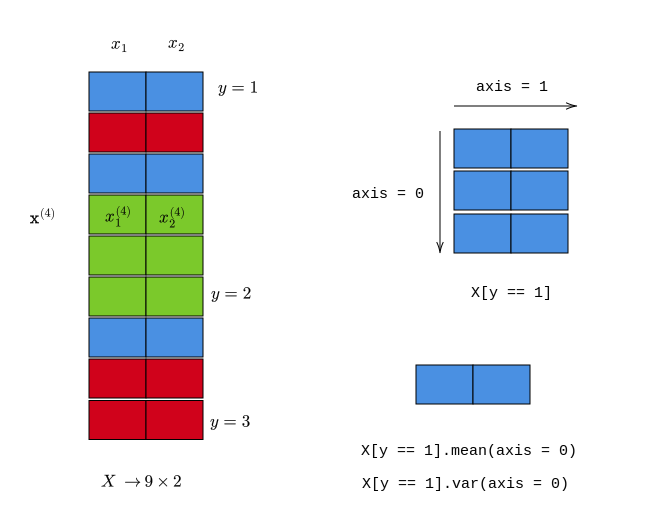

# Course Outline

- Linear regression

- Least square classification
- Perceptron
- Logistic regression
- **Naive Bayes**
- Softmax regression
- K-NN
- Support Vector Machines (SVM)
- Decision trees
- Ensemble techniques
- K-means clustering
- Artificial Neural Networks

# Multivariate Normal Distribution

::: {.columns align=center}

::: {.column width="25%"}

 

 

 
$$
\mathbf{x} \sim \mathcal{N}(\boldsymbol{\mu}, \mathbf{\Sigma})
$$

:::

::: {.column width="75%"}

 

 

:::

:::

# Multivariate Normal Distribution

::: {.columns align=center}

::: {.column width="25%"}

 

 

 
$$
\mathbf{x} \sim \mathcal{N}(\boldsymbol{\mu}, \mathbf{\Sigma})
$$

:::

::: {.column width="75%"}

 

 
$$
\mathbf{x} = \begin{bmatrix}
x_1\\
\vdots\\
x_n
\end{bmatrix} \quad \quad \boldsymbol{\mu} = \begin{bmatrix}
\mu_1\\
\vdots\\
\mu_n
\end{bmatrix}
$$
 
$$
\Sigma_{ij} = \mathbf{E}[(x_i - \mu_i)(x_j - \mu_j)] = \text{Cov}[x_i, x_j]
$$

:::

:::

# Multivariate Normal Distribution

::: {.columns align=center}

::: {.column width="25%"}

 

 

 
$$
\mathbf{x} \sim \mathcal{N}(\boldsymbol{\mu}, \mathbf{\Sigma})
$$

:::

::: {.column width="75%"}

 

 
$$
f_{\mathbf{x}}(x_1, \cdots, x_n) = \cfrac{\exp \left[ -\cfrac{1}{2} (\mathbf{x} - \boldsymbol{\mu})^T \mathbf{\Sigma}^{-1} (\mathbf{x} - \boldsymbol{\mu}) \right]}{\sqrt{(2 \pi)^n|\mathbf{\Sigma}|}}
$$

:::

:::

# Bivariate Normal Distribution (Diagonal $\Sigma$)

::: {.columns align=center}

::: {.column width="50%"}

 

 
$$
\mathbf{x} = \begin{bmatrix}
x_1\\
x_2
\end{bmatrix} \quad \quad \boldsymbol{\mu} = \begin{bmatrix}
\mu_1\\
\mu_2
\end{bmatrix}
$$
 
$$
\mathbf{\Sigma} = \begin{bmatrix}
\sigma_1^2 & 0\\
0 & \sigma_2^2
\end{bmatrix}
$$

:::

:::

::: {.column width="50%"}

 

 

:::

:::

# Bivariate Normal Distribution (Diagonal $\Sigma$)

::: {.columns align=center}

::: {.column width="25%"}

 

 
$$
\mathbf{x} = \begin{bmatrix}
x_1\\
x_2
\end{bmatrix} \quad \quad \boldsymbol{\mu} = \begin{bmatrix}
\mu_1\\
\mu_2
\end{bmatrix}
$$
 
$$
\mathbf{\Sigma} = \begin{bmatrix}
\sigma_1^2 & 0\\
0 & \sigma_2^2
\end{bmatrix}
$$

:::

::: {.column width="75%"}

 

 
$$
\begin{bmatrix}
x_1 - \mu_1 & x_2 - \mu_2
\end{bmatrix} 
\begin{bmatrix}
\frac{1}{\sigma_1^2} & 0\\
0 & \frac{1}{\sigma_2^2}
\end{bmatrix}
\begin{bmatrix}
x_1 - \mu_1\\
x_2 - \mu_2
\end{bmatrix}
$$

:::

:::

# Bivariate Normal Distribution (Diagonal $\Sigma$)

::: {.columns align=center}

::: {.column width="25%"}

 

 
$$
\cfrac{\exp \left[ -\cfrac{1}{2} (\mathbf{x} - \boldsymbol{\mu})^T \mathbf{\Sigma}^{-1} (\mathbf{x} - \boldsymbol{\mu}) \right]}{\sqrt{(2 \pi)^n|\mathbf{\Sigma}|}}
$$

:::

::: {.column width="75%"}

 

 
$$
\left( \cfrac{x_1 - \mu_1}{\sigma_1} \right)^2 + \left( \cfrac{x_2 - \mu_2}{\sigma_2} \right)^2
$$

:::

:::

# Bivariate Normal Distribution (Diagonal $\Sigma$)

::: {.columns align=center}

::: {.column width="25%"}

 

 
$$
\cfrac{\exp \left[ -\cfrac{1}{2} (\mathbf{x} - \boldsymbol{\mu})^T \mathbf{\Sigma}^{-1} (\mathbf{x} - \boldsymbol{\mu}) \right]}{\sqrt{(2 \pi)^n|\mathbf{\Sigma}|}}
$$

:::

::: {.column width="75%"}

 

 
$$
\cfrac{\exp  \left[ -\cfrac{1}{2}\left( \cfrac{x_1 - \mu_1}{\sigma_1} \right)^2 -  \cfrac{1}{2}\left( \cfrac{x_2 - \mu_2}{\sigma_2} \right)^2 \right]}{\sqrt{(2 \pi)^2 \sigma_1^2 \sigma_2^2}}
$$

:::

:::

# Bivariate Normal Distribution (Diagonal $\Sigma$)

::: {.columns align=center}

::: {.column width="25%"}

 

 
$$
\cfrac{\exp \left[ -\cfrac{1}{2} (\mathbf{x} - \boldsymbol{\mu})^T \mathbf{\Sigma}^{-1} (\mathbf{x} - \boldsymbol{\mu}) \right]}{\sqrt{(2 \pi)^n|\mathbf{\Sigma}|}}
$$

:::

::: {.column width="75%"}

 

 
$$
\cfrac{\exp  \left[ -\cfrac{1}{2}\left( \cfrac{x_1 - \mu_1}{\sigma_1} \right)^2\right] \cdot \exp \left[ -\cfrac{1}{2}\left( \cfrac{x_2 - \mu_2}{\sigma_2} \right)^2 \right]}{\sqrt{(2 \pi) \sigma_1^2 } \cdot \sqrt{(2 \pi) \sigma_2^2 }}
$$

:::

:::

# Bivariate Normal Distribution (Diagonal $\Sigma$)

::: {.columns align=center}

::: {.column width="100%"}

 

 
$$
f_{\mathbf{X}}(x_1, x_2) = f_{x_1}(x_1) \cdot f_{x_2}(x_2)
$$

:::

::: {.column width="0%"}

 

 

:::

:::

# Bivariate Normal Distribution (Diagonal $\Sigma$)

::: {.columns align=center}

::: {.column width="100%"}

 

 
$$
f_{\mathbf{X}}(x_1, x_2) = f_{x_1}(x_1) \cdot f_{x_2}(x_2)
$$

 

$x_1$ and $x_2$ are independent

:::

::: {.column width="0%"}

 

 

:::

:::

# Gaussian NB

::: {.columns align=center}

::: {.column width="100%"}

 

 
$$
P(x, y) = P(y) \cdot P(x\ |\ y)
$$
:::

::: {.column width="0%"}

 

 

:::

:::

# Gaussian NB

::: {.columns align=center}

::: {.column width="100%"}

 

 
$$
P(x, y) = P(y) \cdot P(x\ |\ y)
$$
 

$P(x\ |\ y)$ is a multivariate Gaussian with ————— covariance matrix.

:::

::: {.column width="0%"}

 

 

:::

:::

# Gaussian NB

::: {.columns align=center}

::: {.column width="100%"}

 

 
$$
P(x, y) = P(y) \cdot P(x\ |\ y)
$$
 

$P(x\ |\ y)$ is a multivariate Gaussian with diagonal covariance matrix.

:::

::: {.column width="0%"}

 

 

:::

:::

# MLE

::: {.columns align=center}

::: {.column width="100%"}

 

 
$$
\max \prod \limits_{i = 1}^{n} P(y^{(i)}) P(x^{(i)}\ |\ y^{(i)})
$$

:::

::: {.column width="0%"}

 

 

:::

:::

# MLE

::: {.columns align=center}

::: {.column width="100%"}

 

 
$$
\max \prod \limits_{i = 1}^{n} P(y^{(i)}) \prod \limits_{j = 1}^{m} P(x_{j}^{(i)}\ |\ y^{(i)})
$$

:::

::: {.column width="0%"}

 

 

:::

:::

# MLE

::: {.columns align=center}

::: {.column width="100%"}

 

 
$$
\max \sum \limits_{i = 1}^{n} \log P(y^{(i)}) \sum \limits_{j = 1}^{m} \log P(x_{j}^{(i)}\ |\ y^{(i)})
$$

:::

::: {.column width="0%"}

 

 

:::

:::

# MLE

::: {.columns align=center}

::: {.column width="100%"}

 

 
$$
\max \sum \limits_{i = 1}^{n} \log P(y^{(i)}) \sum \limits_{j = 1}^{m} -\cfrac{1}{2} \log (2 \pi \sigma_j^2) - \cfrac{1}{2} \left( \cfrac{x_j^{(i)} - \mu_j}{\sigma_j} \right)^2 
$$

:::

::: {.column width="0%"}

 

 

:::

:::

# MLE

::: {.columns align=center}

::: {.column width="40%"}

 

 
$$
\hat{\mu}_{jc} = \cfrac{\sum \limits_{1 = 1}^{n} x_j^{(i)} \mathcal{1}\{y^{(i)} = c\}}{\sum \limits_{i = 1}^{n} \mathcal{1}\{y^{(i)} = c\}}
$$
:::

::: {.column width="60%"}

 

 
$$
\sigma_{jc}^2 = \cfrac{\sum \limits_{1 = 1}^{n} (x_j^{(i)} - \hat{\mu}_{jc})^2 \mathcal{1}\{y^{(i)} = c\}}{\sum \limits_{i = 1}^{n}  \mathcal{1}\{y^{(i)} = c\}}
$$

:::

:::

# MLE

::: {.columns align=center}

::: {.column width="40%"}

 

 
$$
\boldsymbol{\hat{\mu}_c} = \cfrac{\sum \limits_{i = 1}^{n} \mathbf{x^{(i)}}\mathcal{1}\{y^{(i)} = c\}}{\sum \limits_{i = 1}^{n}\mathcal{1}\{y^{(i)} = c\}}
$$

:::

::: {.column width="60%"}

 

 
$$
\text{diag}(\mathbf{\Sigma_c}) = \cfrac{\sum \limits_{i = 1}^{n} (\mathbf{x^{(i)} - \boldsymbol{\hat{\mu}}_{c}}) \odot (\mathbf{x^{(i)} - \boldsymbol{\hat{\mu}}_{c}}) \mathcal{1}\{y^{(i)} = c\}}{\sum \limits_{i = 1}^{n}\mathcal{1}\{y^{(i)} = c\}}
$$

:::

:::

# NumPy

::: {.columns align=center}

::: {.column width="100%"}

{width="800"}

:::

::: {.column width="0%"}

 

 

:::

:::

# NumPy

::: {.columns align=center}

::: {.column width="100%"}

{width="1000"}

:::

::: {.column width="0%"}

 

 

:::

:::

# Inference

::: {.columns align=center}

::: {.column width="100%"}

 

 
$$
\hat{y} = \arg \max_{c} P(y = c\ |\ x)
$$
:::

::: {.column width="50%"}

 

 

:::

:::

# Inference

::: {.columns align=center}

::: {.column width="100%"}

 

 
$$
\hat{y} = \arg \max_{c} P(y = c) P(x\ |\ y = c)
$$
:::

::: {.column width="50%"}

 

 

:::

:::

# Inference

::: {.columns align=center}

::: {.column width="100%"}

{width="1000"}

:::

::: {.column width="50%"}

 

 

:::

:::