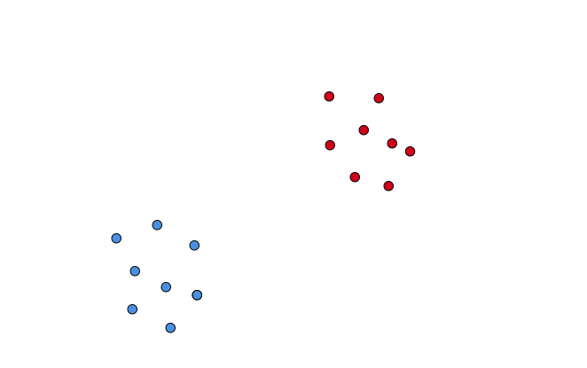
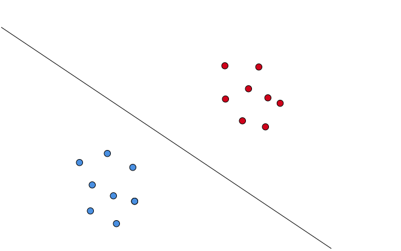
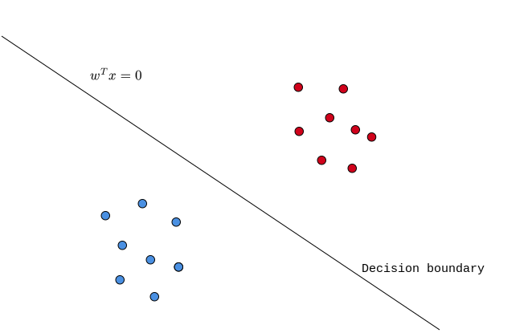
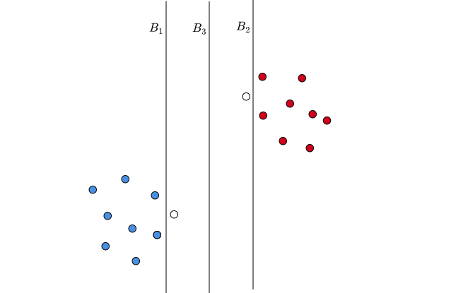

# Course Outline

- Linear regression

- Least square classification
- Perceptron
- Logistic regression
- Naive Bayes
- Softmax regression
- **Support Vector Machines (SVM)**
- Decision trees
- Ensemble techniques
- K-means clustering
- Artificial Neural Networks

# Lecture Outline

::: incremental

- **Motivation**
- Geometry
- Hard-margin SVM
  - Formulation
  - Optimization (recap)
  - Optimization
- Soft-margin SVM
- Approximate solution

:::

# Story so far

::: {.columns align=center}

::: {.column width="100%"}

{width="900"}

:::

::: {.column width="0%"}

:::

:::

# Story so far

::: {.columns align=center}

::: {.column width="100%"}

{width="900"}

:::

::: {.column width="0%"}

:::

:::

# Story so far

::: {.columns align=left}

::: {.column width="50%"}

:::

::: {.column width="50%"}

 

 

::: incremental

- Least square classification
- Perceptron
- Logistic regression

:::

:::

:::

# Story so far

::: {.columns align=left}

::: {.column width="50%"}

:::

::: {.column width="50%"}

 

 

- Least square classification
- Perceptron
- Logistic regression

What is a common among all these models?

:::

:::

# Story so far

::: {.columns align=left}

::: {.column width="50%"}

:::

::: {.column width="50%"}

 

 

- Least square classification
- Perceptron
- Logistic regression

What is a common among all these models?

:::

:::

# Boundaries

::: {.columns align=center}

::: {.column width="50%"}

 

 

:::

::: {.column width="50%"}

:::

:::

# Boundaries

::: {.columns align=center}

::: {.column width="100%"}

{width="900"}

:::

::: {.column width="0%"}

:::

:::

# Boundaries

::: {.columns align=center}

::: {.column width="100%"}

{width="900"}

:::

::: {.column width="0%"}

:::

:::

# Boundaries

::: {.columns align=center}

::: {.column width="100%"}

{width="900"}

:::

::: {.column width="0%"}

:::

:::

# "Best" Boundary?

::: {.columns align=center}

::: {.column width="100%"}

{width="900"}

:::

::: {.column width="0%"}

:::

:::

# "Best" Boundary?

::: {.columns align=center}

::: {.column width="100%"}

{width="900"}

:::

::: {.column width="0%"}

:::

:::

# "Best" Boundary?

::: {.columns align=center}

::: {.column width="100%"}

{width="900"}

:::

::: {.column width="0%"}

:::

:::

# "Best" Boundary?

::: {.columns align=center}

::: {.column width="100%"}

{width="900"}

:::

::: {.column width="0%"}

:::

:::

# "Best" Boundary?

::: {.columns align=left}

::: {.column width="100%"}

 

 

::: incremental

- A decision boundary that is  "pointo-phobic" is a good one.

- Stay away from data-points of either class.
- The most pointo-phobic boundary is the best one.
- The "middle path".

:::

:::

::: {.column width="0%"}

:::

:::

