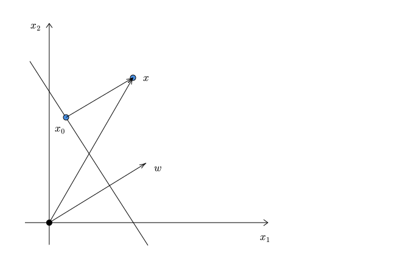

# Course Outline

- Linear regression

- Least square classification
- Perceptron
- Logistic regression
- Naive Bayes
- Softmax regression
- **Support Vector Machines (SVM)**
- Decision trees
- Ensemble techniques
- K-means clustering
- Artificial Neural Networks

# Lecture Outline

::: incremental

- Motivation
- **Geometry**
- Hard-margin SVM
  - Formulation
  - Optimization (recap)
  - Optimization
- Soft-margin SVM
- Approximate solution

:::

# Geometry

::: {.columns align=center}

::: {.column width="50%"}

{width="900"}

:::

::: {.column width="50%"}

:::

:::

# Geometry

::: {.columns align=center}

::: {.column width="50%"}

{width="900"}

:::

::: {.column width="50%"}

 

 

 
$$
w_0 \cdot 1 + w_1 \cdot x_1 + w_2 \cdot x_2 = 0
$$

:::

:::

# Geometry

::: {.columns align=center}

::: {.column width="50%"}

{width="900"}

:::

::: {.column width="50%"}

 

 

 
$$
w_0 + w_1 x_1 + w_2 x_2 = 0
$$

:::

:::

# Geometry

::: {.columns align=center}

::: {.column width="50%"}

{width="900"}

:::

::: {.column width="50%"}

 

 

 
$$
w_1 x_1 + w_2 x_2 + b = 0
$$

:::

:::

# Geometry

::: {.columns align=center}

::: {.column width="50%"}

{width="900"}

:::

::: {.column width="50%"}

 

 

 
$$
w^T x + b = 0
$$

:::

:::

# Geometry

::: {.columns align=left}

::: {.column width="50%"}

{width="900"}

:::

::: {.column width="50%"}

 

 

::: incremental

If we have $m$ features:

- $x \in \mathbb{R}^m$
- $w \in \mathbb{R}^m$
- $b \in \mathbb{R}$
- $w^Tx + b = 0$ is a hyperplane in $\mathbb{R}^m$

:::

:::

:::

# Geometry

::: {.columns align=left}

::: {.column width="50%"}

{width="900"}

:::

::: {.column width="50%"}

 

 

::: incremental

If $w^Tx + b = 0$ is a hyperplane, then:

- $(2w)^Tx + 2b = 0$ 
- $(3w)^Tx + 3b = 0$
- $(kw)^Tx + kb = 0$, where $k \neq 0$  
- For a given hyperplane, $(w, b)$ is not unique

:::

:::

:::

# Distance

::: {.columns align=center}

::: {.column width="50%"}

{width="900"}

:::

::: {.column width="50%"}

:::

:::

# Distance

::: {.columns align=center}

::: {.column width="50%"}

{width="900"}

:::

::: {.column width="50%"}

:::

:::

# Distance

::: {.columns align=center}

::: {.column width="50%"}

{width="900"}

:::

::: {.column width="50%"}

:::

:::

# Distance

::: {.columns align=center}

::: {.column width="50%"}

{width="900"}

:::

::: {.column width="50%"}
$$
\begin{array}[c|c|c]
& w^Tx + b & = \qquad \qquad \qquad \qquad\  &
\end{array}
$$
:::

:::

# Distance

::: {.columns align=center}

::: {.column width="50%"}

{width="900"}

:::

::: {.column width="50%"}
$$
\begin{array}[c|c|c]
& w^Tx + b & = & w^T(x - x_0 + x_0) + b\\\\
\end{array}
$$
:::

:::

# Distance

::: {.columns align=center}

::: {.column width="50%"}

{width="900"}

:::

::: {.column width="50%"}
$$
\begin{array}[c|c|c]
& w^Tx + b & = & w^T(x - x_0 + x_0) + b\\\\
& = & w^T(x - x_0) + w^T x_0 + b &\\\\
\end{array}
$$
:::

:::

# Distance

::: {.columns align=center}

::: {.column width="50%"}

{width="900"}

:::

::: {.column width="50%"}
$$
\begin{array}[c|c|c]
& w^Tx + b & = & w^T(x - x_0 + x_0) + b\\\\
& = & w^T(x - x_0) + w^T x_0 + b &\\\\
& = & w^T(x - x_0)
\end{array}
$$
:::

:::

# Distance

::: {.columns align=center}

::: {.column width="50%"}

{width="900"}

:::

::: {.column width="50%"}
$$
\begin{array}[c|c|c]
& w^Tx + b & = & w^T(x - x_0 + x_0) + b\\\\
& = & w^T(x - x_0) + w^T x_0 + b &\\\\
& = & w^T(x - x_0)\\\\
& = & ||w|| \cdot ||x - x_0||\\\\
\end{array}
$$
:::

:::

# Distance

::: {.columns align=center}

::: {.column width="50%"}

{width="900"}

:::

::: {.column width="50%"}
$$
\begin{array}[c|c|c]
& w^Tx + b & = & w^T(x - x_0 + x_0) + b\\\\
& = & w^T(x - x_0) + w^T x_0 + b &\\\\
& = & w^T(x - x_0)\\\\
& = & ||w|| \cdot ||x - x_0||\\\\
||x - x_0|| & = & \cfrac{w^Tx + b}{||w||}
\end{array}
$$
:::

:::

# Distance

::: {.columns align=center}

::: {.column width="50%"}

{width="900"}

:::

::: {.column width="50%"}
$$
\begin{array}[c|c|c]
& w^Tx + b & = & w^T(x - x_0 + x_0) + b\\\\
& = & w^T(x - x_0) + w^T x_0 + b &\\\\
& = & w^T(x - x_0)\\\\
& = & ||w|| \cdot ||x - x_0||\\\\
||x - x_0|| & = & \cfrac{w^Tx + b}{||w||}
\end{array}
$$
 

**NOTE**: If $x$ is on the other side of the boundary, we have to introduce a negative sign.

:::

:::

# Distance

::: {.columns align=center}

::: {.column width="50%"}

{width="900"}

:::

::: {.column width="50%"}

Distance of a point $x$ from the hyperplane specified by $(w, b)$ is given by:

 
$$
\huge  \left | \cfrac{w^Tx + b}{||w||} \right |
$$

:::

:::

