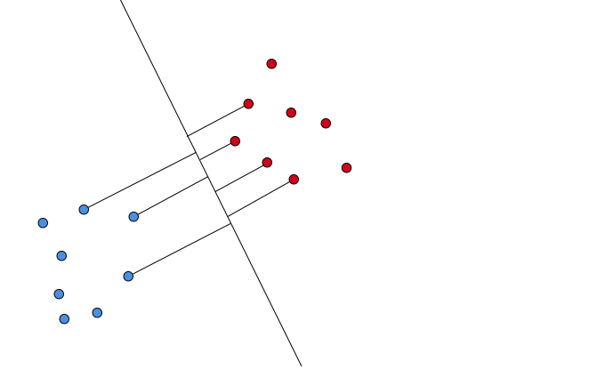
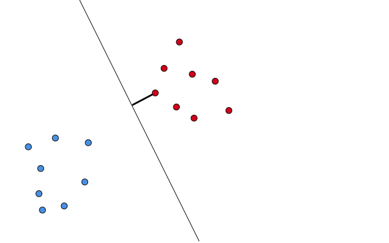
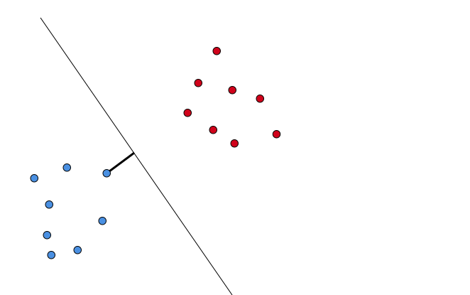
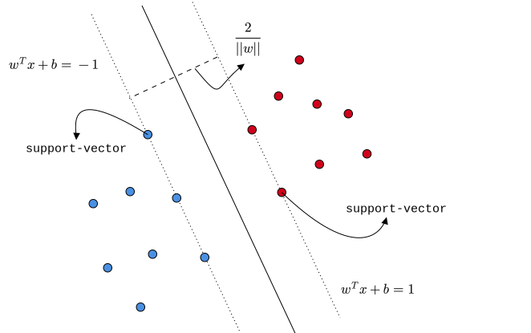

# Course Outline

- Linear regression

- Least square classification
- Perceptron
- Logistic regression
- Naive Bayes
- Softmax regression
- **Support Vector Machines (SVM)**
- Decision trees
- Ensemble techniques
- K-means clustering
- Artificial Neural Networks

# Lecture Outline

::: incremental

- Motivation
- Geometry
- **Hard-margin SVM**
  - **Formulation**
  - Optimization (recap)
  - Optimization
- Soft-margin SVM
- Approximate solution

:::

# Pointo-phobic…

::: {.columns align=center}

::: {.column width="100%"}

 

 

 

Stay away from data-points of either class

:::

::: {.column width="0%"}

:::

:::

# Margin

::: {.columns align=center}

::: {.column width="100%"}

{width="800"}

:::

::: {.column width="50%"}

:::

:::

# Margin

::: {.columns align=center}

::: {.column width="100%"}

{width="800"}

:::

::: {.column width="50%"}

:::

:::

# Margin

::: {.columns align=center}

::: {.column width="100%"}

{width="800"}

:::

::: {.column width="50%"}

:::

:::

# Margin

::: {.columns align=left}

::: {.column width="50%"}

{width="800"}

:::

::: {.column width="50%"}

 

 

<u>Margin</u>

Distance of the closest point from the decision boundary

:::

:::

# Margin

::: {.columns align=left}

::: {.column width="50%"}

{width="800"}

:::

::: {.column width="50%"}

 

 

<u>Margin</u>

Distance of the closest point from the decision boundary

:::

:::

# Margin

::: {.columns align=left}

::: {.column width="50%"}

{width="800"}

:::

::: {.column width="50%"}

 

 

<u>Margin</u>

Distance of the closest point from the decision boundary

 

As the decision boundary changes, the margin also changes. 

:::

:::

# Max-Margin

::: {.columns align=left}

::: {.column width="50%"}

{width="800"}

:::

::: {.column width="50%"}

 

 

The best classifier is the one with maximum margin.

:::

:::

# Hard-margin SVM

::: {.columns align=left}

::: {.column width="100%"}

 

 

::: incremental

- **Assumption** — Data-points are linearly separable
- **Hard** decisions: all points of a class *strictly* belong to one side of the boundary
- Find the boundary that has the maximum **margin**
- We can formulate this as an optimization problem

:::

:::

::: {.column width="50%"}

:::

:::

# Setup

::: {.columns align=left}

::: {.column width="100%"}

 

 

::: incremental

- Binary classification problem
- $n$ data-points, $m$ features
- $x_i \in \mathbb{R}^m$, feature vector of the $i^{th}$ point
- $y_i \in \{-1, 1\}$, label of the $i^{th}$ point
- $D = \big \{(x_i, y_i) \big\}_{i = 1}^{n}$

:::

:::

::: {.column width="50%"}

:::

:::

# Formulation

::: {.columns align=left}

::: {.column width="40%"}

 

 

Distance of the $i^{th}$ data-point from the decision boundary

:::

::: {.column width="60%"}

 

 

:::

:::

# Formulation

::: {.columns align=left}

::: {.column width="40%"}

 

 

Distance of the $i^{th}$ data-point from the decision boundary

:::

::: {.column width="60%"}

 

 
$$
d_i = \left| \cfrac{w^Tx_i + b}{||w||} \right|
$$
:::

:::

# Formulation

::: {.columns align=left}

::: {.column width="40%"}

{width="800"}

:::

::: {.column width="60%"}

 

 
$$
d_i = \left| \cfrac{w^Tx_i + b}{||w||} \right|
$$
:::

:::

# Formulation

::: {.columns align=left}

::: {.column width="40%"}

{width="800"}

:::

::: {.column width="60%"}

 

 
$$
d_i = \cfrac{y_i(w^Tx_i + b)}{||w||}
$$
:::

:::

# Formulation

::: {.columns align=left}

::: {.column width="50%"}

 

 

**Margin**: $d$

Distance of the closest point from the boundary

:::

::: {.column width="50%"}

 

 

:::

:::

# Formulation

::: {.columns align=left}

::: {.column width="50%"}

 

 

**Margin**: $d$

Distance of the closest point from the boundary

:::

::: {.column width="50%"}

 

 
$$
d = \min \limits_{i} \quad d_i
$$

:::

:::

# Formulation

::: {.columns align=left}

::: {.column width="50%"}

 

 

**Margin**: $d$

Distance of the closest point from the boundary

:::

::: {.column width="50%"}

 

 
$$
d = \min \limits_{i} \quad  \cfrac{y_i(w^Tx_i + b)}{||w||}
$$

:::

:::

# Formulation

::: {.columns align=left}

::: {.column width="50%"}

 

 

$x_j$ is closest to the boundary

:::

::: {.column width="50%"}

 

 
$$
d = \cfrac{y_j(w^Tx_j + b)}{||w||}
$$

:::

:::

# Formulation

::: {.columns align=left}

::: {.column width="50%"}

 

 

- Recall: $(kw, kb)$ and $(w, b)$ are the same decision boundary for $k \neq 0$

:::

::: {.column width="50%"}

 

 
$$
d = \cfrac{y_j(w^Tx_j + b)}{||w||}
$$

:::

:::

# Formulation

::: {.columns align=left}

::: {.column width="50%"}

 

 

- Recall: $(kw, kb)$ and $(w, b)$ are the same decision boundary for $k \neq 0$
- Choose $(w, b)$ s.t

$$
y_j(w^T x_j + b) = 1
$$

:::

::: {.column width="50%"}

 

 
$$
d = \cfrac{y_j(w^Tx_j + b)}{||w||}
$$

:::

:::

# Formulation

::: {.columns align=left}

::: {.column width="50%"}

 

 

- Recall: $(kw, kb)$ and $(w, b)$ are the same decision boundary for $k \neq 0$
- Choose $(w, b)$ s.t

$$
y_j(w^T x_j + b) = 1
$$

:::

::: {.column width="50%"}

 

 
$$
d = \cfrac{1}{||w||}
$$

:::

:::

# Formulation

::: {.columns align=center}

::: {.column width="100%"}

 

 

Margin of the boundary $(w, b)$ for $D = \big \{(x_i, y_i) \big\}_{i = 1}^{n}$ is given by:

 
$$
d = \cfrac{1}{||w||}
$$
 

Where, $x_j$ is the closest point to it with $y_j(w^T x_j + b) = 1$

:::

::: {.column width="50%"}

:::

:::

# Formulation

::: {.columns align=center}

::: {.column width="100%"}

 

 

 

If $x_j$ is the closest point with $y_j(w^T x_j + b) = 1$, then what can we say about the other points in the dataset?

 

:::

::: {.column width="50%"}

:::

:::

# Formulation

::: {.columns align=center}

::: {.column width="100%"}

 

 

 

If $x_j$ is the closest point with $y_j(w^T x_j + b) = 1$, then:

 
$$
y_i(w^T x_i + b) \geq 1, \quad 1 \leq i \leq n
$$

:::

::: {.column width="50%"}

:::

:::

# Formulation

::: {.columns align=center}

::: {.column width="100%"}

 

 
$$
\max \limits_{w, b} \quad \cfrac{1}{||w||}
$$

 

:::

::: {.column width="0%"}

:::

:::

# Formulation

::: {.columns align=center}

::: {.column width="100%"}

 

 
$$
\max \limits_{w, b} \quad \cfrac{1}{||w||}
$$
 

subject to:

 

:::

::: {.column width="0%"}

:::

:::

# Formulation

::: {.columns align=center}

::: {.column width="100%"}

 

 
$$
\max \limits_{w, b} \quad \cfrac{1}{||w||}
$$
 

subject to:

 
$$
y_i(w^T x_i + b) \geq 1, \quad 1 \leq i \leq n
$$
:::

::: {.column width="0%"}

:::

:::

# Formulation

::: {.columns align=center}

::: {.column width="100%"}

 

 
$$
\min \limits_{w, b} \quad \cfrac{||w||^2}{2}
$$
 

subject to:

 
$$
y_i(w^T x_i + b) \geq 1, \quad 1 \leq i \leq n
$$
:::

::: {.column width="0%"}

:::

:::

# Formulation

::: {.columns align=left}

::: {.column width="40%"}

 

 
$$
\min \limits_{w, b} \quad \cfrac{||w||^2}{2}
$$
 

subject to:

 
$$
y_i(w^T x_i + b) \geq 1, \quad 1 \leq i \leq n
$$
:::

::: {.column width="60%"}

{width="800"}

:::

:::

