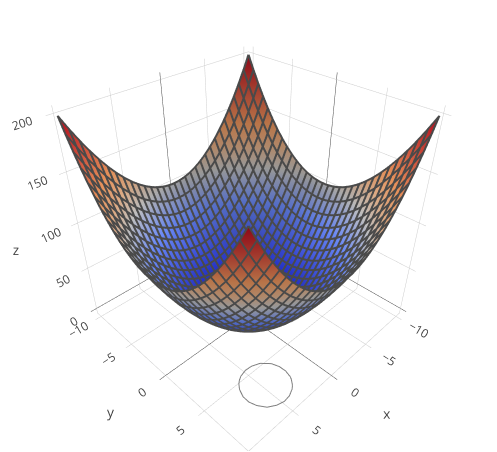
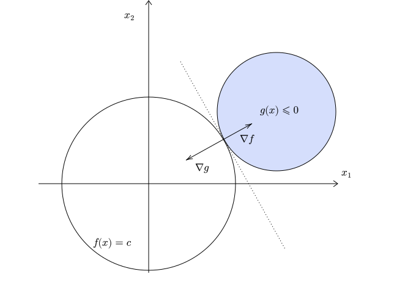
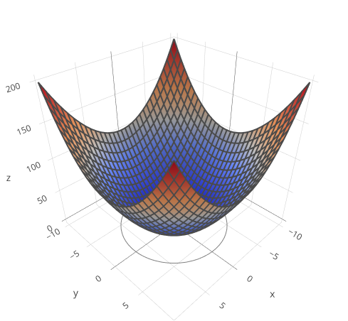
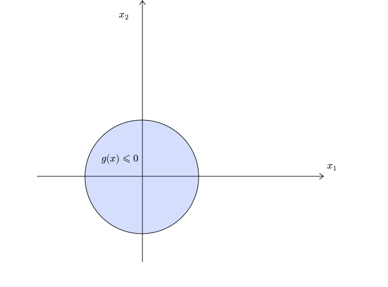

# Course Outline

- Linear regression

- Least square classification
- Perceptron
- Logistic regression
- Naive Bayes
- Softmax regression
- **Support Vector Machines (SVM)**
- Decision trees
- Ensemble techniques
- K-means clustering
- Artificial Neural Networks

# Lecture Outline

::: incremental

- Motivation
- Geometry
- **Hard-margin SVM**
  - Formulation
  - **Optimization (recap)**
  - Optimization
- Soft-margin SVM
- Approximate solution

:::

# Constrained Optimization

::: {.columns align=center}

::: {.column width="50%"}

{width="500"}

:::

::: {.column width="50%"}
$$
\min \limits_{x} \quad x_1^2 + x_2^2
$$
 

subject to

 
$$
(x_1 - 5)^2 + (x_2 - 7)^2 \leq 5
$$

:::

:::

# General Form

::: {.columns align=center}

::: {.column width="50%"}

{width="500"}

:::

::: {.column width="50%"}
$$
\min \limits_{x} \quad f(x)
$$
 

subject to

 
$$
g(x) \leq 0
$$

:::

:::

# Active constraint

::: {.columns align=center}

::: {.column width="50%"}

{width="500"}

:::

::: {.column width="50%"}

{width="700"}

:::

:::

# Active constraint

::: {.columns align=center}

::: {.column width="50%"}

{width="500"}

:::

::: {.column width="50%"}

{width="700"}

:::

:::

# Active constraint

::: {.columns align=center}

::: {.column width="50%"}

{width="500"}

:::

::: {.column width="50%"}

{width="700"}

:::

:::

# Active constraint

::: {.columns align=center}

::: {.column width="50%"}

{width="500"}

:::

::: {.column width="50%"}

{width="700"}

:::

:::

# Active constraint

::: {.columns align=center}

::: {.column width="50%"}

{width="800"}

:::

::: {.column width="50%"}

:::

:::

# Active constraint

::: {.columns align=center}

::: {.column width="50%"}

{width="800"}

:::

::: {.column width="50%"}

:::

:::

# Active constraint

::: {.columns align=center}

::: {.column width="50%"}

{width="800"}

:::

::: {.column width="50%"}

:::

:::

# Active constraint

::: {.columns align=center}

::: {.column width="50%"}

{width="800"}

:::

::: {.column width="50%"}

 

 

 
$$
\nabla f(x) = -\lambda \nabla g(x), \quad \lambda > 0
$$

:::

:::

# Active constraint

::: {.columns align=center}

::: {.column width="50%"}

{width="800"}

:::

::: {.column width="50%"}

 

 

 
$$
\nabla f(x) + \lambda \nabla g(x) = 0, \quad \lambda > 0
$$

:::

:::

# Active constraint

::: {.columns align=center}

::: {.column width="50%"}

{width="800"}

:::

::: {.column width="50%"}

 

 

 
$$
\nabla \left( f(x) + \lambda g(x) \right) = 0, \quad \lambda > 0
$$

:::

:::

# Active constraint

::: {.columns align=left}

::: {.column width="50%"}

{width="650"}

:::

::: {.column width="50%"}

 

::: incremental

$$
\nabla L(x, \lambda) = 0
$$

- $L(x, \lambda) = f(x) + \lambda g(x)$

- $\lambda > 0$

- $g(x) = 0$

- Active constraint

:::

:::

:::

# Inactive constraint

::: {.columns align=center}

::: {.column width="50%"}

{width="500"}

:::

::: {.column width="50%"}

{width="700"}

:::

:::

# Inactive constraint

::: {.columns align=center}

::: {.column width="50%"}

{width="700"}

:::

::: {.column width="50%"}

 

 
$$
\nabla f(x) = 0
$$

:::

:::

# Inactive constraint

::: {.columns align=left}

::: {.column width="50%"}

{width="700"}

:::

::: {.column width="50%"}

 

::: incremental
$$
\nabla L(x, \lambda) = 0
$$

- $L(x, \lambda) = f(x) + \lambda g(x)$

- $\lambda = 0$

- $g(x) < 0$

- Inactive constraint

:::

:::

:::

# Towards KKT

$$
L(x, \lambda) = f(x) + \lambda g(x)
$$

$$
\nabla L(x, \lambda) = 0
$$

::: {.columns align=left}

::: {.column width="50%"}

 

- $\lambda > 0$

- $g(x) = 0$

- Active constraint

:::

::: {.column width="50%"}

 

- $\lambda = 0$

- $g(x) < 0$

- Inactive constraint

:::

:::

# Towards KKT

$$
L(x, \lambda) = f(x) + \lambda g(x)
$$

$$
\nabla L(x, \lambda) = 0
$$

::: {.columns align=left}

::: {.column width="50%"}

 

- $\lambda > 0$

- $g(x) = 0$

- Active constraint

:::

::: {.column width="50%"}

 

- $\lambda = 0$

- $g(x) < 0$

- Inactive constraint

:::
$$
\lambda g(x) = 0
$$

:::

# KKT

**Lagrangian**
$$
L(x, \lambda) = f(x) + \lambda g(x)
$$
**Condition-1**
$$
\nabla L(x, \lambda) = 0
$$
**Condition-2**
$$
g(x) \leq 0
$$
**Condition-3**
$$
\lambda \geq 0
$$
**Condition-4**
$$
\lambda g(x) = 0
$$

# KKT - Template

::: {.columns align=left}

::: {.column width="50%"}

 
$$
\min \limits_{x} \quad f(x)
$$
 

subject to

 
$$
g(x) \leq 0
$$

:::

::: {.column width="50%"}

**Lagrangian**
$$
L(x, \lambda) = f(x) + \lambda g(x)
$$
**Condition-1**
$$
\nabla L(x, \lambda) = 0
$$
**Condition-2**
$$
g(x) \leq 0
$$
**Condition-3**
$$
\lambda \geq 0
$$
**Condition-4**
$$
\lambda g(x) = 0
$$

:::

:::
