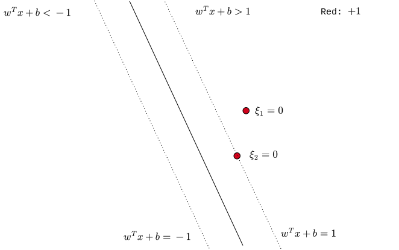
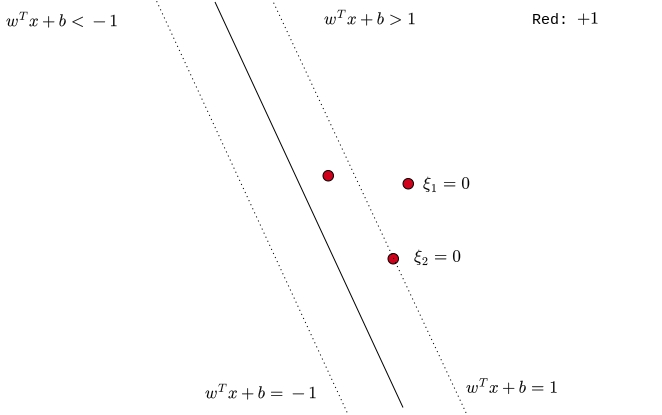
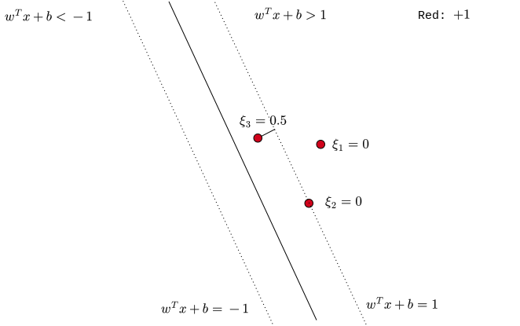
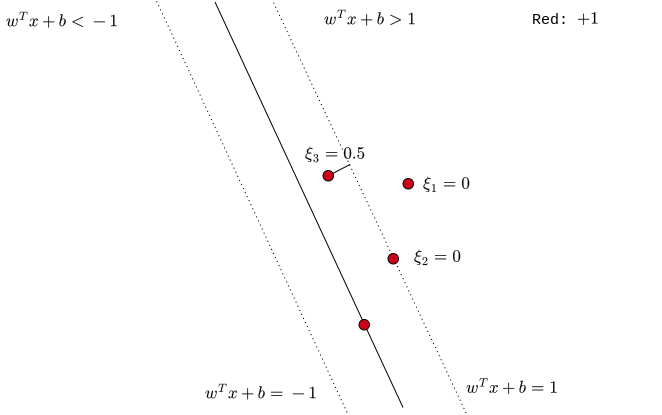
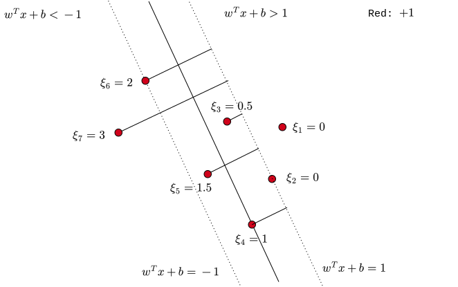

# Course Outline

- Linear regression

- Least square classification
- Perceptron
- Logistic regression
- Naive Bayes
- Softmax regression
- **Support Vector Machines (SVM)**
- Decision trees
- Ensemble techniques
- K-means clustering
- Artificial Neural Networks

# Lecture Outline

::: incremental

- Motivation
- Geometry
- Hard-margin SVM
  - Formulation
  - Optimization (recap)
  - Optimization
- **Soft-margin SVM**
- Approximate solution

:::

# Nearly Linearly separable

::: {.columns align=center}

::: {.column width="100%"}

{width="800"}

:::

::: {.column width="0%"}

:::

:::

# Nearly Linearly separable

::: {.columns align=center}

::: {.column width="100%"}

{width="800"}

:::

::: {.column width="0%"}

:::

:::

# Errors

::: {.columns align=center}

::: {.column width="100%"}

{width="800"}

:::

::: {.column width="0%"}

:::

:::

# Errors

::: {.columns align=center}

::: {.column width="100%"}

{width="800"}

:::

::: {.column width="0%"}

:::

:::

# Errors

::: {.columns align=center}

::: {.column width="100%"}

{width="800"}

:::

::: {.column width="0%"}

:::

:::

# Errors

::: {.columns align=center}

::: {.column width="100%"}

{width="800"}

:::

::: {.column width="0%"}

:::

:::

# Errors

::: {.columns align=center}

::: {.column width="100%"}

{width="800"}

:::

::: {.column width="0%"}

:::

:::

# Errors

::: {.columns align=center}

::: {.column width="100%"}

{width="800"}

:::

::: {.column width="0%"}

:::

:::

# Errors

::: {.columns align=center}

::: {.column width="100%"}

{width="800"}

:::

::: {.column width="0%"}

:::

:::

# Errors

::: {.columns align=center}

::: {.column width="100%"}

{width="800"}

:::

::: {.column width="0%"}

:::

:::

# Errors

::: {.columns align=center}

::: {.column width="100%"}

{width="800"}

:::

::: {.column width="0%"}

:::

:::

# Errors

::: {.columns align=center}

::: {.column width="100%"}

{width="800"}

:::

::: {.column width="0%"}

:::

:::

# Errors

::: {.columns align=center}

::: {.column width="40%"}

{width="700"}

:::

::: {.column width="60%"}

 

 

 
$$
\xi_i = \begin{cases}
0,\ & x_i \text{ outside margin}\\
1 - y_i(w^T x_i + b), \ & x_i \text{ inside margin}\\
\end{cases}
$$

:::

:::

# Constraints

::: {.columns align=center}

::: {.column width="40%"}

{width="700"}

:::

::: {.column width="60%"}

 

 
$$
\xi_i = \begin{cases}
0,\ & x_i \text{ outside margin}\\
1 - y_i(w^T x_i + b), \ & x_i \text{ inside margin}\\
\end{cases}
$$
 
$$
\xi_i \geq 0
$$
and
$$
y_i(w^T x_i + b) \geq 1 - \xi_i
$$

:::

:::

# Objective function

::: {.columns align=center}

::: {.column width="100%"}

 

 
$$
\cfrac{||w||^2}{2} + C \sum \limits_{i = 1}^{n} \xi_i
$$

:::

::: {.column width="50%"}

:::

:::

# Primal

::: {.columns align=center}

::: {.column width="100%"}

 
$$
\min \limits_{w, b} \quad\cfrac{||w||^2}{2} + C \sum \limits_{i = 1}^{n} \xi_i
$$
 

subject to

 
$$
\xi_i \geq 0,\quad 1 \leq i \leq n
$$
 
$$
y_i(w^T x_i + b) \geq 1 - \xi_i, \quad 1 \leq i \leq n
$$

:::

::: {.column width="50%"}

:::

:::

# Dual

::: {.columns align=center}

::: {.column width="100%"}

 
$$
\max \limits_{\lambda}\quad  \sum \limits_{i = 1}^{n} \lambda_i - \cfrac{1}{2} \sum \limits_{i = 1}^{n} \sum \limits_{j = 1}^{n} (y_i y_j x_i^Tx_j)  \lambda_i \lambda_j
$$
 

subject to:

 
$$
0 \leq \lambda_i \leq C, \quad 1 \leq i \leq n
$$
 
$$
\sum \limits_{i = 1}^{n} \lambda_i y_i = 0
$$

:::

::: {.column width="50%"}

:::

:::

