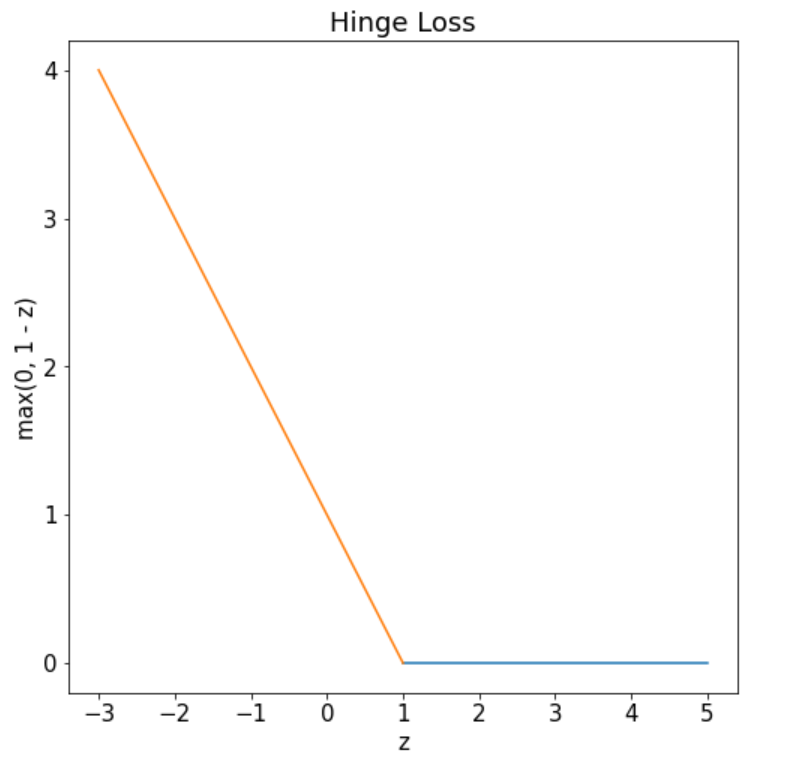

# Course Outline

- Linear regression

- Least square classification
- Perceptron
- Logistic regression
- Naive Bayes
- Softmax regression
- **Support Vector Machines (SVM)**
- Decision trees
- Ensemble techniques
- K-means clustering
- Artificial Neural Networks

# Lecture Outline

::: incremental

- Motivation
- Geometry
- Hard-margin SVM
  - Formulation
  - Optimization (recap)
  - Optimization
- Soft-margin SVM
- **Approximate solution**

:::

# Formulation

::: {.columns align=center}

::: {.column width="50%"}

 
$$
\min \limits_{w, b} \quad\cfrac{||w||^2}{2} + C \sum \limits_{i = 1}^{n} \xi_i
$$
 

subject to

 
$$
\xi_i \geq 0,\quad 1 \leq i \leq n
$$
 
$$
y_i(w^T x_i + b) \geq 1 - \xi_i, \quad 1 \leq i \leq n
$$

:::

::: {.column width="50%"}

 

 

 
$$
\xi_i = \begin{cases}
0,\ & x_i \text{ outside margin}\\
1 - y_i(w^T x_i + b), \ & x_i \text{ inside margin}\\
\end{cases}
$$
:::

:::

# Formulation

::: {.columns align=center}

::: {.column width="50%"}

 
$$
\min \limits_{w, b} \quad\cfrac{||w||^2}{2} + C \sum \limits_{i = 1}^{n} \xi_i
$$
 

subject to

 
$$
\xi_i \geq 0,\quad 1 \leq i \leq n
$$
 
$$
y_i(w^T x_i + b) \geq 1 - \xi_i, \quad 1 \leq i \leq n
$$

:::

::: {.column width="50%"}

 

 

 
$$
\xi_i = \max \bigg(0, 1 - y_i(w^Tx_i + b) \bigg)
$$
:::

:::

# Formulation

::: {.columns align=center}

::: {.column width="50%"}

 
$$
\min \limits_{w, b} \quad\cfrac{||w||^2}{2} + C \sum \limits_{i = 1}^{n} \xi_i
$$
 

subject to

 
$$
\xi_i \geq 0,\quad 1 \leq i \leq n
$$
 
$$
y_i(w^T x_i + b) \geq 1 - \xi_i, \quad 1 \leq i \leq n
$$

:::

::: {.column width="50%"}

 

 

 
$$
\min \limits_{w, b} \quad\cfrac{||w||^2}{2} + C \sum \limits_{i = 1}^{n} \max \bigg(0, 1 - y_i(w^Tx_i + b) \bigg)
$$
:::

:::

# Formulation

::: {.columns align=left}

::: {.column width="50%"}

 
$$
\min \limits_{w, b} \quad\cfrac{||w||^2}{2} + C \sum \limits_{i = 1}^{n} \xi_i
$$
 

subject to

 
$$
\xi_i \geq 0,\quad 1 \leq i \leq n
$$
 
$$
y_i(w^T x_i + b) \geq 1 - \xi_i, \quad 1 \leq i \leq n
$$

:::

::: {.column width="50%"}

 

 

 
$$
\min \limits_{w, b} \quad\cfrac{||w||^2}{2} + C \sum \limits_{i = 1}^{n} \max \bigg(0, 1 - y_i(w^Tx_i + b) \bigg)
$$
 

::: incremental

- Unconstraind
- Convex objective
- Enter gradient descent

:::

:::

:::

# Loss

::: {.columns align=left}

::: {.column width="50%"}

 

 

 
$$
\small{\min \limits_{w, b} \quad\cfrac{||w||^2}{2} + C \sum \limits_{i = 1}^{n} \max \bigg(0, 1 - y_i(w^Tx_i + b) \bigg)}
$$

:::

::: {.column width="50%"}

::: incremental

- $\small \sum \limits_{i = 1}^{n} \max \bigg(0, 1 - y_i(w^Tx_i + b) \bigg)$ — loss function

- $C > 0$ is a regularization term
- $C$ controls the amount of slackness (OR) margin violations we can tolerate  
- Does this expression remind you of regularized linear regression?
- What happens when:
  - $C \ll 1$
  - $C \rightarrow \infty$

:::

:::

:::

# Hinge Loss

::: {.columns align=center}

::: {.column width="100%"}

 

 
$$
\max \bigg(0, 1 - y_i(w^Tx_i + b) \bigg)
$$
:::

::: {.column width="50%"}

:::

:::

# Hinge Loss

::: {.columns align=center}

::: {.column width="100%"}

 

 
$$
\max \bigg(0, 1 - z \bigg)
$$
:::

::: {.column width="50%"}

:::

:::

# Hinge Loss

::: {.columns align=center}

::: {.column width="50%"}

 

 
$$
\max \bigg(0, 1 - z \bigg)
$$
:::

::: {.column width="50%"}

{width="600"}

:::

:::

# Gradients

::: {.columns align=center}

::: {.column width="50%"}

 

 
$$
f(z) = \max \bigg(0, 1 - z \bigg)
$$
:::

::: {.column width="50%"}

 

 
$$
\nabla_z f = \begin{cases}
0, & z \geq 1\\
-1, & z < 1
\end{cases}
$$
:::

:::

# Gradients

::: {.columns align=center}

::: {.column width="50%"}

 

 
$$
f(w, b) = \max \bigg(0, 1 - y_i(w^T x_i + b) \bigg)
$$
:::

::: {.column width="50%"}

 

 
$$
\nabla_w f = \begin{cases}
0, & y_i(w^T x_i + b) \geq 1\\
-y_i x_i, &  y_i(w^T x_i + b) < 1
\end{cases}
$$
:::

:::

# Gradients

::: {.columns align=center}

::: {.column width="50%"}

 

 
$$
f(w, b) = \max \bigg(0, 1 - y_i(w^T x_i + b) \bigg)
$$
:::

::: {.column width="50%"}

 

 
$$
\nabla_w f = \begin{cases}
0, & y_i(w^T x_i + b) \geq 1\\
-y_i x_i, &  y_i(w^T x_i + b) < 1
\end{cases}
$$
 
$$
\nabla_b f = \begin{cases}
0, & y_i(w^T x_i + b) \geq 1\\
-y_i, &  y_i(w^T x_i + b) < 1
\end{cases}
$$
:::

:::

