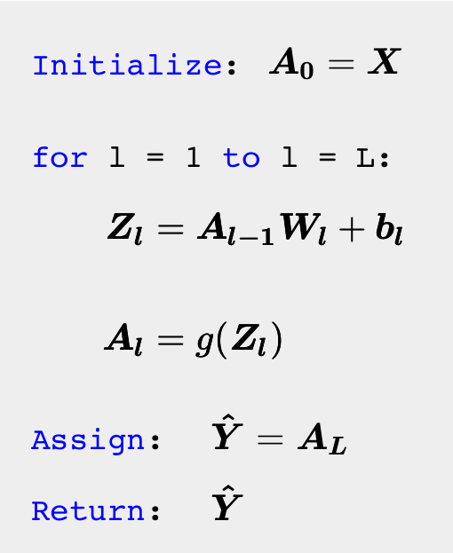

# Forward pass

As stated earlier, the network can be seen as a function $h: \mathbb{R}^{m} \rightarrow \mathbb{R}^{k}$. In the case of a multi-class classification problem, given a data-point $\boldsymbol{x} \in \mathbb{R}^m$, the network outputs a vector of probabilities.
$$
h(\boldsymbol{x}) = \boldsymbol{\hat{y}}
$$
If the feature matrix $\boldsymbol{X}$ of size $n \times m$ is passed as input, we get a matrix of probabilities, $\boldsymbol{\hat{Y}}$ of size $n \times k$. For a regression problem, $k = 1$ and the output is interpreted as some real number. This input-output relationship can be computed in an iterative manner. This is termed as a forward pass.

## Activations

First we look at what happens at one layer of the network. At any layer, there are three steps that have to be performed in this sequence:

- Accept input
- Linearly combine the inputs
- Apply the activation function

What comes out of a layer are called the activations at that layer. The linear combination of the inputs to a layer are called the pre-activations.

$\boldsymbol{Z_l}$ and $\boldsymbol{A_l}$ represent the matrices of pre-activations and activations respectively at layer $l$ for $0 \leq l \leq L$. $\boldsymbol{A_0} = \boldsymbol{X}$, the feature matrix. The activation matrix $\boldsymbol{A_l}$ is of size $n \times S_l$. Each row of the activation matrix corresponds to the activation vector for one of the $n$ data-points.

## Algorithm

If $\boldsymbol{A_{l - 1}}$ represents the activation matrix at layer $l - 1$, then the activations at layer $l$ can be computed iteratively using the following pair of equations:

$$
\begin{aligned}
\boldsymbol{Z_{l}} &= \boldsymbol{A_{l - 1} W_l} + \boldsymbol{b_l},\quad 1 \leq l \leq L\\ \\
\boldsymbol{A_{l}} &= g(\boldsymbol{Z_{l}}),\quad 1 \leq l \leq L
\end{aligned}
$$

Here, $\boldsymbol{A_0} = \boldsymbol{X}$. The shapes of these matrices/vectors are as follows:

- $\boldsymbol{A_{l - 1}}$: $n \times S_{l - 1}$ 
- $\boldsymbol{W_l}$: $S_{l - 1} \times S_{l}$
- $\boldsymbol{b_l}$: $S_l$
- $\boldsymbol{Z_l}$: $n \times S_l$
- $\boldsymbol{A_{l}}$: $n \times S_{l}$

Note that $\boldsymbol{b_{l}}$ gets added to each row of the product $\boldsymbol{A_{l - 1} W_{l}}$ according to `NumPy` broadcasting rules. $g$ is the hidden-layer activation function for $1 \leq l \leq L - 1$ and the output-layer activation function for $l = L$. The final shape of the output activations at layer $L$ is:

- $n$ for regression and binary classification problems
- $n \times k$ for a multi-class classification problem

According to our notation, $\boldsymbol{A_L} = \boldsymbol{\hat{Y}}$. The algorithm can now be specfieid as given below:

{width="40%"}
