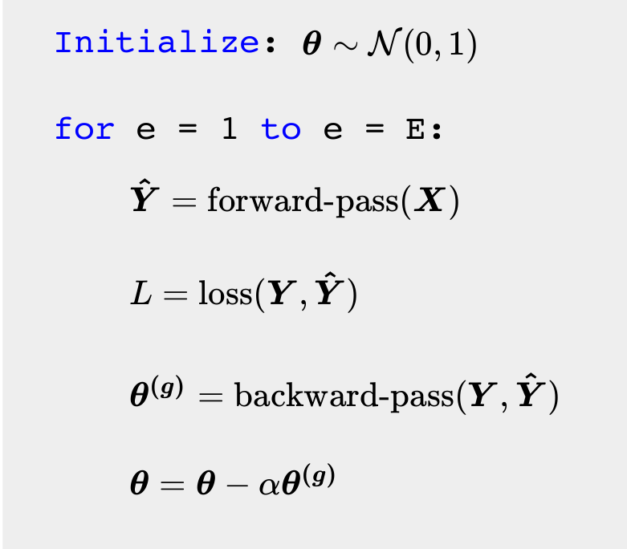

# Learning Algorithm

We now have all the ingredients to specify the learning algorithm. Let $\boldsymbol{\theta}$ refer to all the parameters in the model. We can now define the following functions:

- $\boldsymbol{\hat{Y}} = \text{forward-pass}(\boldsymbol{X})$
- $L = \text{loss}(\boldsymbol{Y}, \boldsymbol{\hat{Y}})$
- $\boldsymbol{\theta^{(g)}} = \text{backward-pass}(\boldsymbol{Y}, \boldsymbol{\hat{Y}})$

Only the most important arguments are displayed here. With this, we can define the learning algorithm for neural networks:

{width="50%"} 